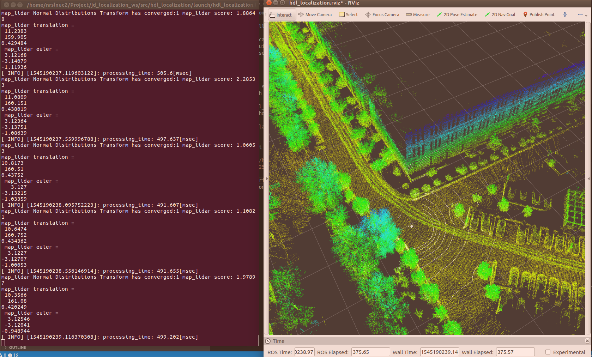
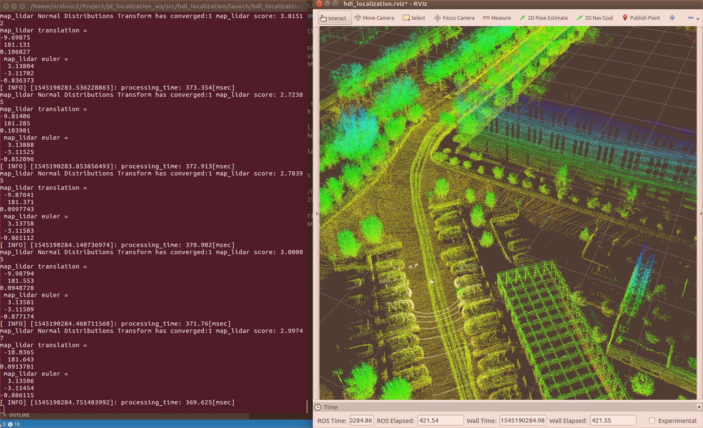

### JD Competition Lidar Localization Workspace

## Install
```
cd jd_localization
catkin build
. devel/setup.bash
```

## Run
```
rosparam set use_sim_time true
roslaunch hdl_localization hdl_localization.launch

roscd hdl_localizatrion/rviz
rviz -d hdl_localizatrion.rviz

rosbag play --clock semifinal.bag -r 0.5
```

## Result

 
 

The algorithm takes about 400ms in our dual-core i5 NUC for once lidar localization.

## Remark

### The Processor package contains programs and scripts for data processing.
- extract_jd_part: extract a 30m square map from jd cloud map
- extract_jd_part: extract a 20m square map from jd cloud map  
- icp_example: use icp algorithm in pcl library to registration two submaps
- ndt_omp: use ndt algorithm to registration two submaps
- separate_ground: separate object and ground from a map
- show: show two map in same frame
- voxel_grid: downsampling the point cloud with the given precision